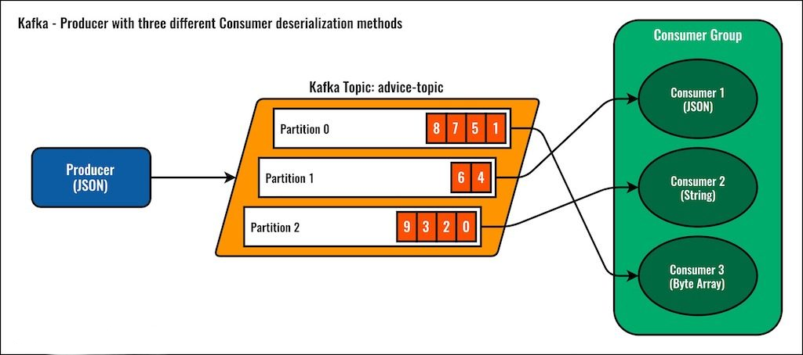

# Broker client

A Slow Event Streaming client for Git


## Motivation

`Lego Mindstorms EV3` is the first programmable brick which it is able to run a `Linux OS` inside, and
it has `Internet connection capabilities`. Using the Brick, you can develop educational robots which
run software to manage `data` from Sensors & Actuators. In the ecosystem you could find many awesome examples
but it is not common to use the bricks in a remote way, and it is hard to find Bricks communicating each others outside
of your local network.

In real world, large distributed systems implements Event-Driven architectures (EDA)
and Streaming architectures to manage a huge amount of data to solve problems.

Why not explore with the help of Bricks the development of some examples to `"imitate"` some architectural patterns
with Bricks?

## Why Git?

`Git` is a free and open source distributed version control system. On Internet exist some companies
which offer `free` git accounts to store the code.

**Why not use a Git repository as a persistant event storage for your events?**

## What components are common in a Streaming platform?

- The producer
- The consumer
- The reader
- The topics
- The partitions



## Features included with the client:

- Produce Messages
- Consume Messages
- Read Messages
- Initial partition support

## Limitations:

- It is not possible to create a Node in High Availability

## Examples

``` java
@Slf4j
public class PingPongDemoTest extends BaseTestContainersTest {

    @Tag("complex")
    @Test
    public void given_PingPong_when_execute_then_Ok() {

        final String topic1 = "PING";
        final String topic2 = "PONG";
        final int iterations = 5;
        final int timeout = 60;

        var playersList = List.of(
            new Player(topic1, topic2, iterations, timeout),
            new Player(topic2, topic1, iterations, timeout));
        var futureRequests = playersList.stream()
            .map(Player::runAsync)
            .collect(toList());
        var results = futureRequests.stream()
            .map(CompletableFuture::join)
            .reduce(0L, (x1, x2) -> x1 + x2);

        then(results).isEqualTo((iterations - 1) * 2);
        verify(topic1, iterations);
        verify(topic2, iterations);
    }

    private void verify(String TOPIC, int iterations) {

        GitBrokerClient client = GitBrokerClient.builder()
            .serviceUrl(BROKER_TEST_ADDRESS)
            .build();

        Reader<String> reader = client.newReader()
            .topic(TOPIC)
            .create();

        int counter = 0;
        while (true) {
            if (reader.hasReachedEndOfTopic()) {
                break;
            }
            Message<String> value = reader.readNext();
            LOGGER.info(value.getValue());
            counter++;
        }
        LOGGER.info("{}", counter);
        then(counter).isEqualTo(iterations);
    }

    private interface Client<T> {

        T run();

        CompletableFuture<T> runAsync();
    }

    private static class Player implements Client<Long> {

        private final String TOPIC_PRODUCE;
        private final String TOPIC_CONSUME;
        private final int iterations;

        private final GitBrokerClient client;
        private final Producer<String> producer;
        private final Consumer<String> consumer;
        private final int timeout;

        private final Authentication authentication =
            new Authentication("user", "user@my-email.com", "xxx", "yyy");

        public Player(
            @NonNull String topicProduce,
            @NonNull String topicConsume,
            @NonNull int iterations,
            @NonNull int timeout) {

            this.TOPIC_PRODUCE = topicProduce;
            this.TOPIC_CONSUME = topicConsume;
            this.iterations = iterations;
            this.timeout = timeout;

            client = GitBrokerClient.builder()
                .serviceUrl(BROKER_TEST_ADDRESS)
                .authentication(authentication)
                .build();

            producer = client.newProducer()
                .topic(TOPIC_PRODUCE)
                .create();

            consumer = client.newConsumer()
                .topic(TOPIC_CONSUME)
                .subscribe();
        }

        @Override
        public Long run() {
            LOGGER.info(TOPIC_PRODUCE);
            return IntStream.rangeClosed(1, iterations).boxed()
                .mapToLong(x -> {
                    LOGGER.info("Iteration {}: {}", TOPIC_PRODUCE, x);
                    Messages<String> messages = consumer.batchReceive();
                    producer.send(TOPIC_PRODUCE);
                    return StreamSupport.stream(messages.spliterator(), false).count();
                })
                .reduce(0L, (x, y) -> x + y);
        }

        @Override
        public CompletableFuture<Long> runAsync() {

            LOGGER.info("Thread: {}", Thread.currentThread().getName());
            CompletableFuture<Long> future = CompletableFuture
                .supplyAsync(() -> run())
                .orTimeout(this.timeout, TimeUnit.SECONDS)
                .handle((response, ex) -> {
                    if (!Objects.isNull(ex)) {
                        LOGGER.error(ex.getLocalizedMessage(), ex);
                    }
                    return response;
                });
            return future;
        }
    }
}
```

## JDK Requeriments in EV3

Current default JVM has an issue with `CA Certificates` and it is necessary to
install a complete JDK. Create a ssh session with your EV3 Brick and execute
the following steps:

```
wget https://ci.adoptopenjdk.net/view/ev3dev/job/eljbuild/job/stretch-14/lastSuccessfulBuild/artifact/build/jdk-ev3.tar.gz
sudo tar -zxvf jdk-ev3.tar.gz -C /opt
sudo mv /opt/jdk/ /opt/jdk-14
sudo update-alternatives --install /usr/bin/java java /opt/jdk-14/bin/java 2014
java -version
```

You should see:

```
openjdk version "14" 2020-03-17
OpenJDK Runtime Environment (build 14+36-ev3-unreleased)
OpenJDK Client VM (build 14+36-ev3-unreleased, mixed mode, sharing)
```

## Dependency

In order to use this library, you need to add the following
dependency:

```
<repositories>
    <repository>
        <id>jitpack.io</id>
        <url>https://jitpack.io</url>
    </repository>
</repositories>
```

```
<dependency>
    <groupId>com.github.broker-game</groupId>
    <artifactId>broker-client</artifactId>
    <version>0.3.0</version>
</dependency>
```

- https://jitpack.io/#broker-game/broker-client/0.3.0

## How to build the project?

```
mvn clean test -DexcludedGroups=complex


# Generate Checkstyle report
mvn clean site -DskipTests
mvn clean test site -DexcludedGroups=complex
```
